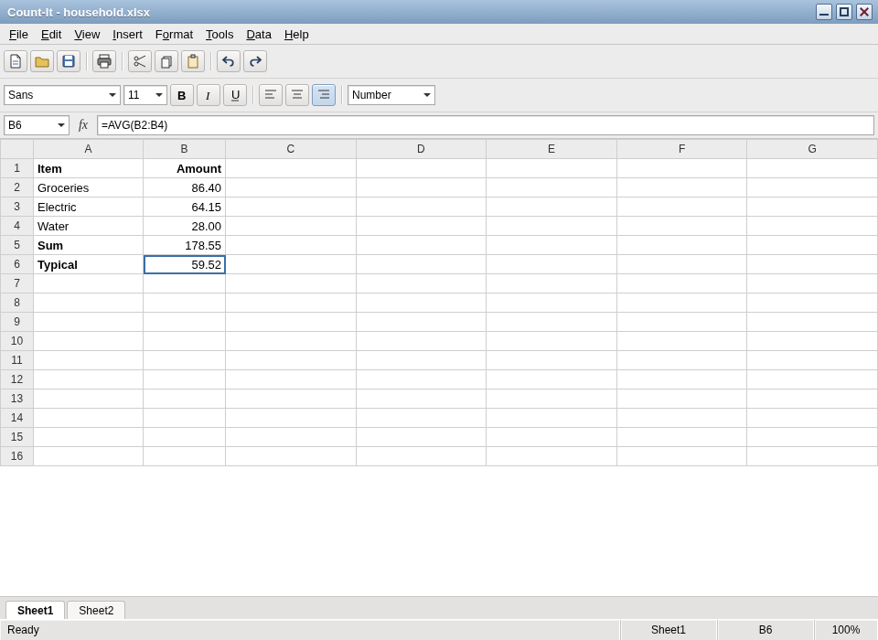

# Count-It

**Vended by Grok Build**

An **Excel 97-shaped spreadsheet** for The Lunduke Computer Operating System (LCOS). Count-It is the spreadsheet in Retro-Office, beside Write-It and Show-It.

Binary: `count-it`. Unlicense.

LCOS itself: [https://github.com/BryanLunduke/LCOS](https://github.com/BryanLunduke/LCOS)

## Status

**Specification.** No release yet. The specification and the M0–M5 milestone plan are in [DEVELOPMENT.md](DEVELOPMENT.md). The package tag is `v0.1.0`.

Save writes a simple `.xlsx`. Export writes CSV of the displayed values.

| Doc | What |
|---|---|
| [DEVELOPMENT.md](DEVELOPMENT.md) | Specification, window, `.xlsx`, formulas, and the M0–M5 milestone plan |

## License

[The Unlicense](https://unlicense.org). See [UNLICENSE](UNLICENSE).
